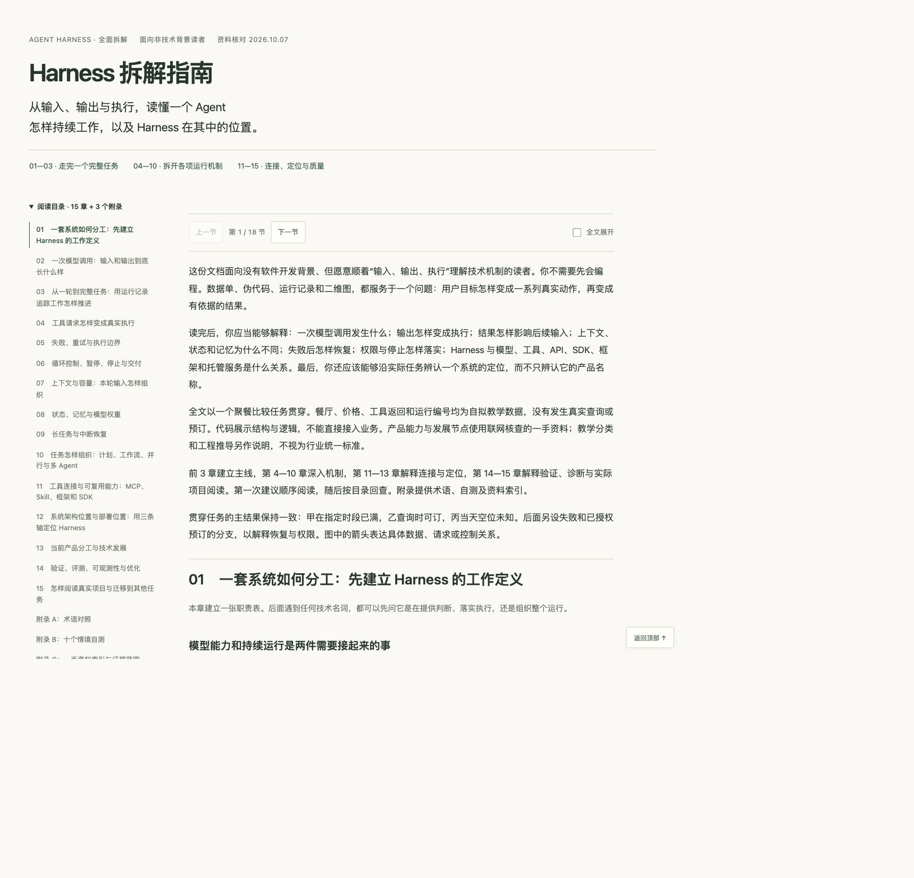

# learnDSH

面向非技术背景读者的 Agent Harness 学习资料。从“输入、输出、执行”出发，理解一个 Agent 怎样持续工作，以及 Harness 在系统架构和当前技术中的位置。仓库同时保留 DeepSeek Harness（dsh）的专项学习资料。

## 从这里开始

**[阅读《Agent Harness 全面拆解指南》](docs/agent-harness/guide.md)**

全文约 3.2 万中文字，包含 15 个正文章、3 个附录与 35 项一手资料。无需编程基础，沿同一个任务展开模型调用、工具执行、反馈、上下文、状态与任务验收。

| 格式 | 入口 | 使用方式 |
| --- | --- | --- |
| Markdown 全文 | [guide.md](docs/agent-harness/guide.md) | 在 GitHub 直接阅读，或下载编辑 |
| HTML 阅读版 | [reading.html](docs/agent-harness/reading.html) | 下载该文件，再用浏览器打开；支持按章阅读、全文展开和自测答案 |

HTML 文件内含样式、脚本和二维图解，可独立打开，无需安装依赖或启动本地服务器。下载时可在文件页面使用下载按钮，或下载整个仓库后打开 `docs/agent-harness/reading.html`。

## 文档讲什么

- **第 1—3 章：建立完整主线**。分清模型、Harness、工具与 Agent 产品，展开两轮输入、输出与执行，再追踪一项任务的运行记录和最终交付。
- **第 4—10 章：拆开运行机制**。工具路由、参数与权限检查、失败重试、沙箱与 Hook、循环控制、上下文容量、检索与压缩、状态与记忆、中断恢复、计划与多 Agent。
- **第 11—13 章：理解连接与定位**。MCP、Skill、框架和 SDK；Harness 的逻辑职责、部署地点与开发抽象；当前 API、SDK、预置 Harness 和托管服务的产品分工与技术发展。
- **第 14—15 章：判断工作是否办好**。任务验证、系统评测、日志与过程追踪、质量与费用、延迟优化，以及怎样阅读真实项目和迁移到代码任务。
- **附录：随时回查**。术语对照、十个情境自测及答案、一手资料索引与证据范围。

第一次建议顺序阅读。需要先找系统位置时，可从第 12 章入手，再看第 13 章的当前产品对照。

## 阅读版预览

展开查看界面

## 资料与示例

资料核查日期为 **2026 年 10 月 7 日**。产品与技术事实的来源放在正文对应位置，并在附录 C 汇总。滚动文档与产品能力可能随版本变化。

贯穿文档的餐厅、价格、查询返回和运行编号均为自拟教学数据；代码与伪代码用于解释结构和职责。文档按联网一手资料独立编写，教学分类、工程推导与产品事实分别说明。

## DeepSeek Harness 专项资料

- [dsh-book.html](dsh-book.html)：交互式导读书。
- [dsh-visual-guide.html](dsh-visual-guide.html)：早期版可视化页面。
- [DSH-代码报告与使用指南.md](DSH-代码报告与使用指南.md)：源码分析报告与上手指南。

相关上游：[deepseek-ai/deepseek-harness](https://github.com/deepseek-ai/deepseek-harness)。`deepseek-harness/` 上游源码目录已被 Git 忽略，不随本仓库发布。
