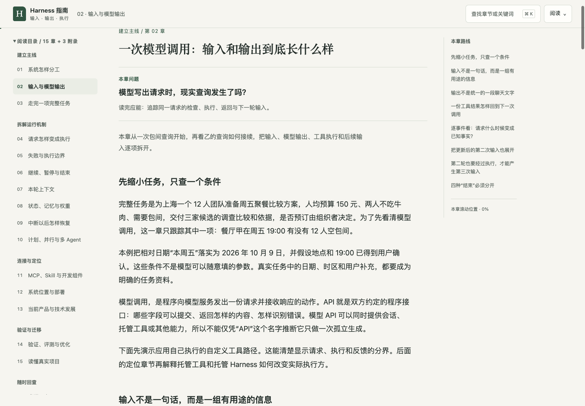

# learnDSH

面向非技术背景读者的 Agent Harness 学习资料。从“输入、输出、执行”出发，理解一个 Agent 怎样持续工作，以及 Harness 在系统架构和当前技术中的位置。仓库同时保留 DeepSeek Harness（dsh）的专项学习资料。

## 从这里开始

**[阅读《Agent Harness 全面拆解指南》](docs/agent-harness/guide.md)**

全文约 3.3 万中文字，包含 15 个正文章、3 个附录与 37 项一手资料。无需编程基础，沿同一个任务展开模型调用、工具执行、反馈、上下文、状态与任务验收。

| 格式 | 入口 | 使用方式 |
| --- | --- | --- |
| Markdown 全文 | [guide.md](docs/agent-harness/guide.md) | 在 GitHub 直接阅读，或下载编辑 |
| HTML 阅读版 | [reading.html](docs/agent-harness/reading.html) | 下载该文件，再用浏览器打开；支持分组目录、本章路线、本地查找、两档字号、全文展开、教学实验和自测答案 |

HTML 文件内含样式、脚本和二维图解，可独立打开，无需安装依赖或启动本地服务器。下载时可在文件页面使用下载按钮，或下载整个仓库后打开 `docs/agent-harness/reading.html`。

## 图解与教学实验

阅读版现有 **9 幅二维机制图、4 个预设教学实验**。沿同一任务看谁负责、具体传了什么、哪个条件改变了后续动作。

| 所在章 | 实验 | 用来理解什么 |
| --- | --- | --- |
| 第 2 章 | 六事件单步与回看 | 请求、检查、执行、返回与后续输入的分界 |
| 第 4 章 | 只改一个字段的三层检查 | 格式合法、业务合理与已有授权是三个判断 |
| 第 7 章 | 勾选记录并组装输入预览 | 外部保存的资料不自动进入本轮上下文 |
| 第 9 章 | 四个情境与解释反馈 | 有限重试、未知副作用核对、等待批准与业务验收 |

实验均为教学模拟，不调用真实模型或餐厅；回看与重新演示不会代表撤销外部操作。正文完整保留，新增图和实验贴近相应规则；支持原生键盘操作与窄屏阅读。

## 教材研究与规划

本次优化参考 16 个原作者 HTML 教材案例，整理为 **7 种展现方法、7 种交互方法**，完成 **100 条有来源的研究与设计判断**。初稿经独立复核，有 6 条弱项补作具体对照，原记录和修订轨迹保留。计数不代表真人测试或浏览器实验次数。

- [研究包与验收入口](docs/agent-harness/harness-teaching-redesign/index.md)
- [目标受众、内容和验收基线](docs/agent-harness/harness-teaching-redesign/00-需求与验收基线.md)
- [展现方法库](docs/agent-harness/harness-teaching-redesign/references/display/index.md) · [交互方法库](docs/agent-harness/harness-teaching-redesign/references/interaction/index.md)
- [现有大纲与逻辑链](docs/agent-harness/harness-teaching-redesign/review/01-现有大纲与逻辑链.md) · [定稿图文规划](docs/agent-harness/harness-teaching-redesign/review/05-定稿大纲与图文交互规划.md)
- [浏览器与交付验证](docs/agent-harness/harness-teaching-redesign/validation/01-浏览器与交付验证.md)

## 阅读体验与前端美学

新版采用**暖白底、深墨正文和少量墨绿强调**，按中文长文阅读重新组织排版。阅读目录分成五组，宽屏显示本章路线，手机提供目录入口与当前位置；查找可直接进入原文。“阅读”设置中可以调整字号、展开全文，关闭全文或刷新时保留实际阅读章节。

本轮依据前端一手文档完成 **100 条诊断与设计判断、100 张方法卡**，关联 **69 个不同来源 URL**。26 条采纳、64 条调整采用、10 条舍弃；对照三种视觉方向后选择与非技术教材最匹配的一套。100 条研究不是 100 个网站、100 套主题或 100 次用户测试。

- [阅读体验研究包](docs/agent-harness/harness-reading-experience/index.md) · [100 张方法卡](docs/agent-harness/harness-reading-experience/methods/index.md)
- [三种美学方案比较](docs/agent-harness/harness-reading-experience/design/01-独立设计评审.md) · [最终设计规格](docs/agent-harness/harness-reading-experience/design/02-方案选择与设计规格.md)
- [原站布局与交互观察](docs/agent-harness/harness-reading-experience/evidence/01-原站浏览器观察.md)
- [最终前端验收](docs/agent-harness/harness-reading-experience/validation/02-前端最终验收.md)

2026 年 10 月 8 日完成本机浏览器复验：5 种 CSS 宽度下 50 个章节样本无整页横向溢出；导航、查找、键盘、四个实验、深链接、历史与刷新检查通过。正文、9 图、4 实验和 10 自测保留。根字号放大、打印媒体、禁用脚本检查的具体范围写在验收报告中，不将它们称为完整 WCAG 认证或跨浏览器全面测试。

## 文档讲什么

- **第 1—3 章：建立完整主线**。分清模型、Harness、工具与 Agent 产品，展开两轮输入、输出与执行，再追踪一项任务的运行记录和最终交付。
- **第 4—10 章：拆开运行机制**。工具路由、参数与权限检查、失败重试、沙箱与 Hook、循环控制、上下文容量、检索与压缩、状态与记忆、中断恢复、计划与多 Agent。
- **第 11—13 章：理解连接与定位**。MCP、Skill、框架和 SDK；Harness 的逻辑职责、部署地点与开发抽象；当前 API、SDK、预置 Harness 和托管服务的产品分工与技术发展。
- **第 14—15 章：判断工作是否办好**。任务验证、系统评测、日志与过程追踪、质量与费用、延迟优化，以及怎样阅读真实项目和迁移到代码任务。
- **附录：随时回查**。术语对照、十个情境自测及答案、一手资料索引与证据范围。

第一次建议顺序阅读。需要先找系统位置时，可从第 12 章入手，再看第 13 章的当前产品对照。

## 阅读版预览

展开查看界面

## 资料与示例

资料核查日期为 **2026 年 10 月 7 日**。产品与技术事实的来源放在正文对应位置，并在附录 C 汇总。滚动文档与产品能力可能随版本变化。

贯穿文档的餐厅、价格、查询返回和运行编号均为自拟教学数据；代码与伪代码用于解释结构和职责。文档按联网一手资料独立编写，教学分类、工程推导与产品事实分别说明。

## DeepSeek Harness 专项资料

- [dsh-book.html](dsh-book.html)：交互式导读书。
- [dsh-visual-guide.html](dsh-visual-guide.html)：早期版可视化页面。
- [DSH-代码报告与使用指南.md](DSH-代码报告与使用指南.md)：源码分析报告与上手指南。

相关上游：[deepseek-ai/deepseek-harness](https://github.com/deepseek-ai/deepseek-harness)。`deepseek-harness/` 上游源码目录已被 Git 忽略，不随本仓库发布。
