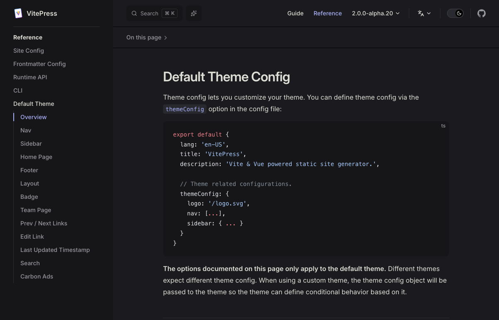
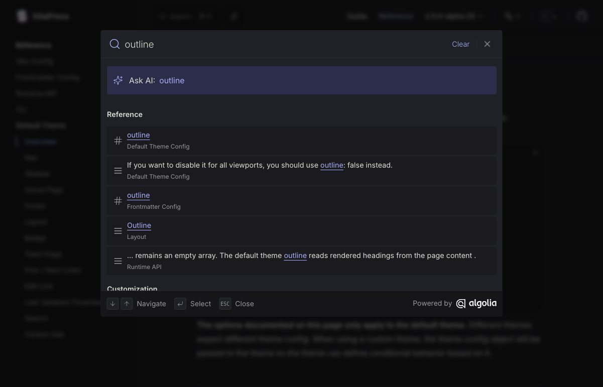
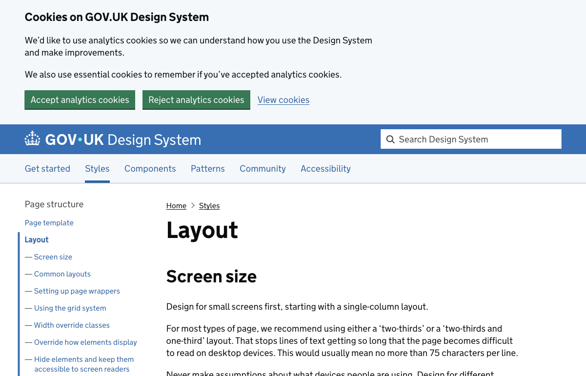
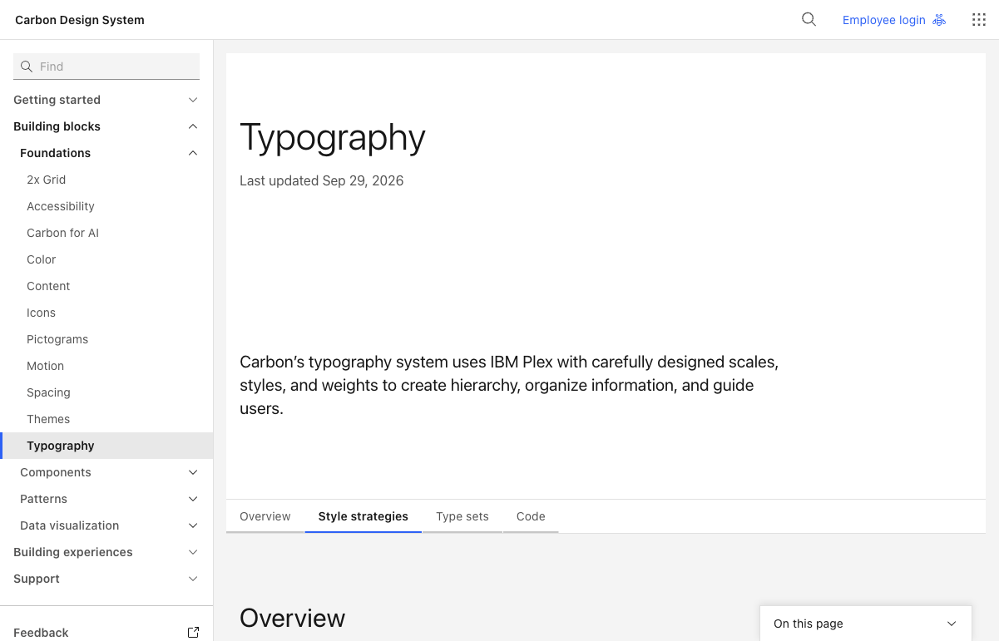

# 原站浏览器观察

日期：2026-10-07 至 2026-10-08。与四组联网文本研究分开，主验收使用同一个浏览器任务空间实际打开以下页面、读取布局并保存截图。截图记录具体时刻，不证明整个站点的所有响应式或交互均已验收。

## VitePress：导航和查找分工

原页：[Default Theme Config](https://vitepress.dev/reference/default-theme-config)。实际看到分组左目录、持续的顶栏、当前页局部路线入口、独立搜索入口。截图中的深色是原站当时呈现的外观，不是本教材最终配色依据。

点击原站搜索，输入 `outline`，等待结果列表出现后保存截图。这个操作验证了“在阅读中打开查找、带着结果语境回查”的形式；没有将其云端索引和快捷键实现照搬到单文件教材。本项目改成无网络请求的本地原文索引。

## GOV.UK：持续的正文列与清楚的层级

原页：[Layout](https://design-system.service.gov.uk/styles/layout/)。实际看到左侧主题导航、正文标题和较稳定的文本列。顶部 Cookie 区是当时原站的真实状态，保留在截图中。教材采用正文单列、清楚的段落节奏和窄屏重排思路，不增加 Cookie、品牌门户和开发者导航负担。

## Carbon：字号体系和操作层级

原页：[Typography](https://www.carbondesignsystem.com/building-blocks/foundations/typography/overview)。首次页面导航等待超时；随后在同一页面确认文档加载完成再读取和截图。没有将初始超时记为页面验收成功。

实际看到章题、说明、主题目录和局部主题切换的不同权重。教材采用少量语义字号与一致组件层级；不加载 IBM 品牌字体，也不把文档切换组件变成每段都要点开的标签页。

## 本项目最终截图

以下是实现后实际浏览器截图，桌面为 1440×1000、手机 CSS 视口为 390×900。手机视口模拟不等于物理手机测试。

- [封面](final-cover.png)
- [桌面章节阅读](final-desktop-reading.png)
- [二维机制图](final-desktop-diagram.png)
- [手机章节阅读](final-mobile-reading.png)
- [手机目录弹层](final-mobile-menu.png)
- [手机查找](final-mobile-search.png)
- [手机教学实验](final-mobile-lab.png)

原站观察提供方法参考，最终主题与教材适配仍属于项目设计判断。三个原站的有限操作不承担其整站可访问性或性能结论。
